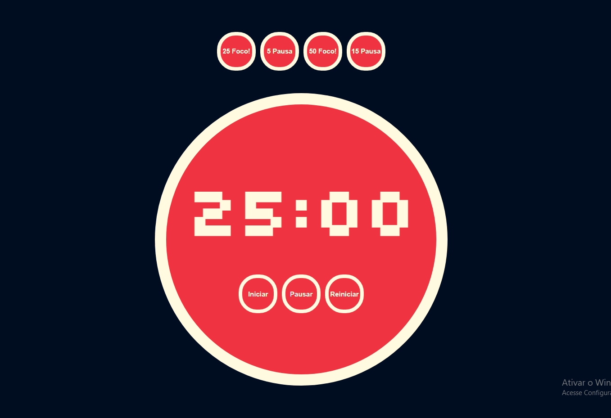

# Projeto página de sorteio

- 📘 Este projeto é uma pomodoro timer. Que é uma técnica que se baseia na ideia de que dividindo o nosso fluxo de trabalho em blocos de concentração intensa, conseguimos melhorar a agilidade do cérebro e estimular nosso foco. Em outras palavras, melhoramos nossa gestão do tempo e ficamos mais eficientes. Portanto, para colocá-la em prática você vai precisar de:

# Timer ou cronômetro para fazer contagem regressiva;

# Uma lista de tarefas (“to-do-list”);

# Lápis e borracha;

- 📘 Primeiramente, você deve fazer uma lista de tarefas a serem desempenhadas durante o dia. Depois, basta dividir seu tempo em períodos de 25 minutos ou 50 minutos (chamados “pomodoros”) e trabalhar ininterruptamente em suas tarefas nesses períodos.

- 📘 Quando o timer tocar, e faça um breve intervalo de 5 minutos ou 15 minutos. Nessa pausa, aproveite para fazer outras coisas não relacionadas à tarefa (ir ao banheiro, ligar para um cliente, tomar um café, etc). 

  

## O projeto: 

<h1 align="center">
    
</h1>

 

## 🛠 &nbsp;Tecnologias utilizadas:

&nbsp;
&nbsp;
&nbsp;
&nbsp;

  

## 👨🏽‍🦲 &nbsp;Autor do projeto: Vinícius Luz; Meu linkedin:

